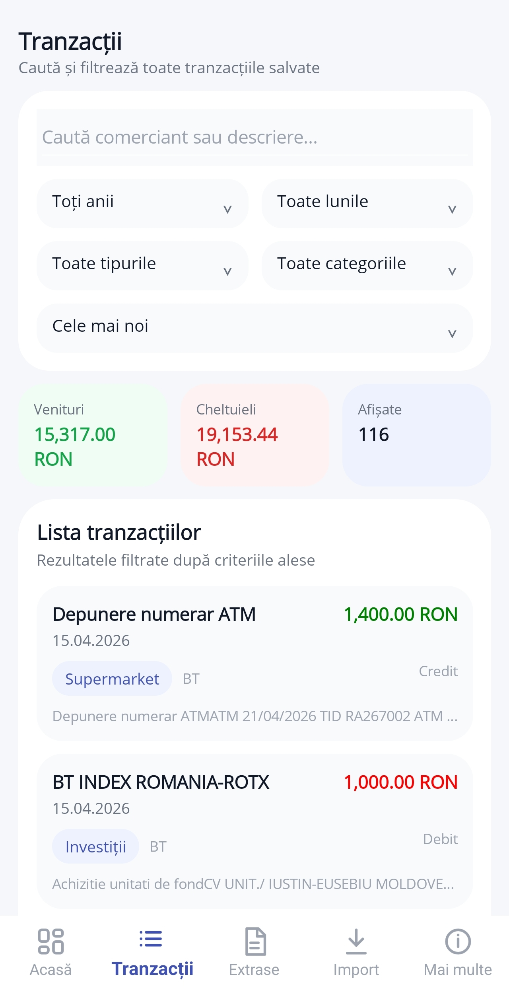
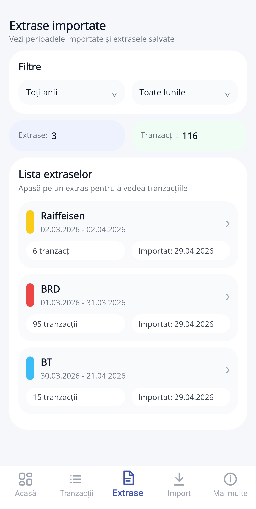
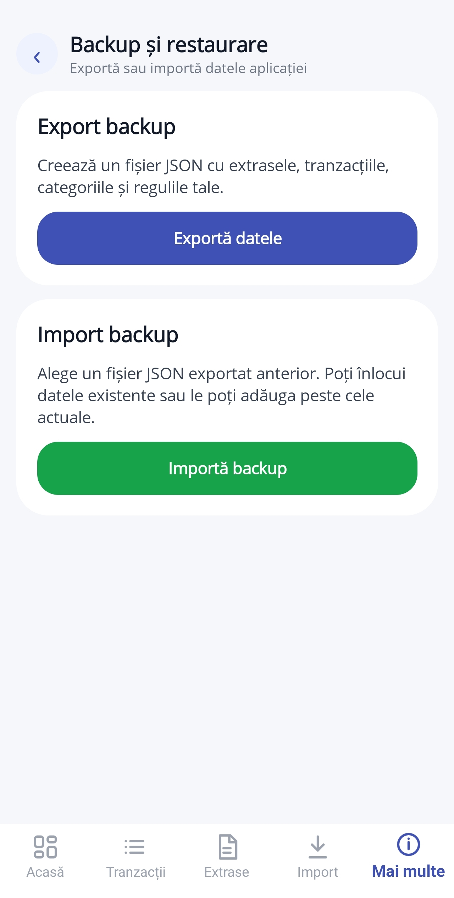
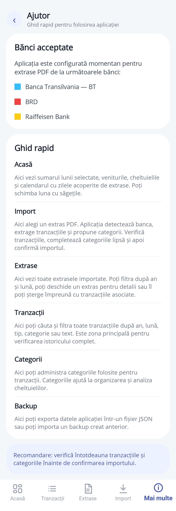

# Aflux 💰

Aflux is a mobile application designed for tracking personal finances by importing and analyzing bank statements.

Built specifically for Romanian users, the app currently supports statement imports from:
- Banca Transilvania (BT)
- BRD
- Raiffeisen Bank

---

## 📸 Screenshots

> ⚠️ The data displayed in the screenshots is sample data and does not represent real personal information.

  
  

  
  

  
  

## 📖 About the Project

Aflux simplifies personal finance management by allowing users to import bank statements (PDF), automatically extract transactions, and organize them into categories.

The application provides a clear overview of income and expenses, along with filtering, search, and data visualization features.

It is designed as both a personal portfolio project and a practical tool for daily financial tracking.

---

## 🚀 Key Features

- 📥 Import bank statements (PDF)
- 🏦 Automatic bank detection (BT, BRD, Raiffeisen)
- 🔍 Advanced transaction filtering and search
- 📊 Monthly overview (income, expenses, transaction count)
- 📅 Calendar-based coverage of imported data
- 🗂️ Category management
- 💾 Backup & restore (JSON export/import)
- 📱 Clean and modern mobile UI

---

## 🛠️ Technologies

- .NET MAUI
- C#
- SQLite (local storage)
- MVVM architecture
- Custom data parsing logic (PDF processing)

---

## 🇷🇴 Localization

The application is designed specifically for Romanian users, supporting local banks and transaction formats.

---

## ⚙️ Getting Started

1. Clone the repository
2. Open the solution in Visual Studio
3. Build and run on Android emulator or device

---

## 🔮 Future Improvements

- Cloud synchronization
- More supported banks
- Automatic transaction categorization (AI-based)
- Budget planning features

---

## 👤 Author

**Iustin Eusebiu Moldoveanu**
